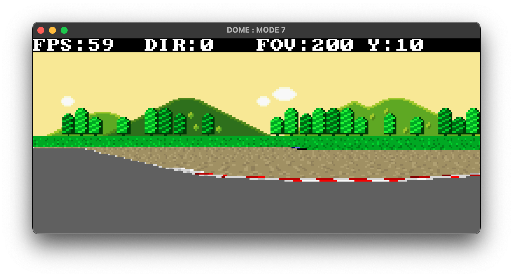
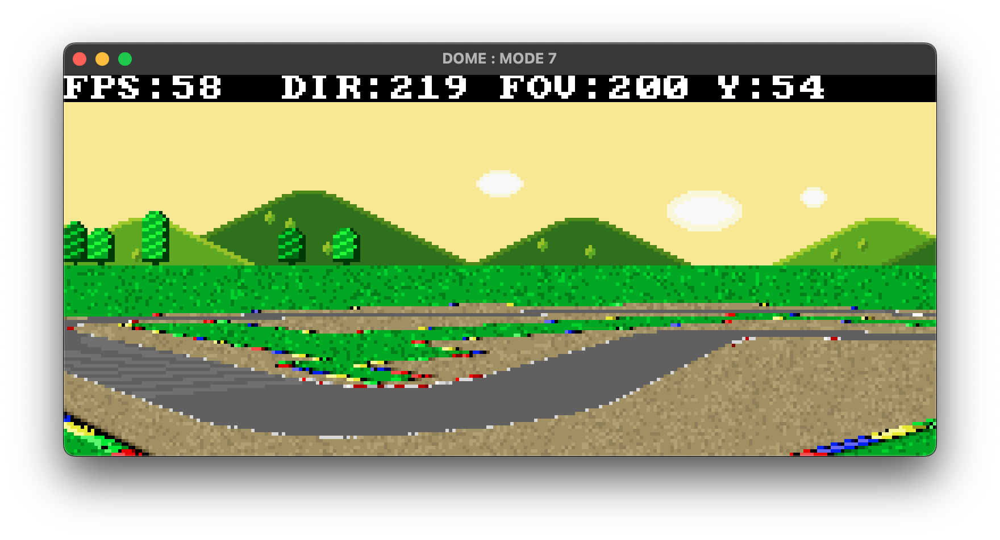
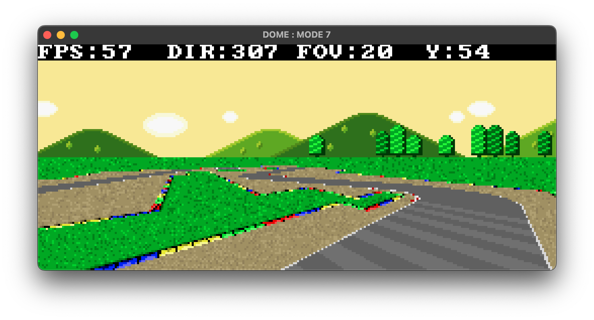

# DOME : Mode 7



This is a simple demo showing Mode 7 using Dome Engine (Wren scripting language).

## Controls

* Movement : `WASD` or `Arrows`
* Change FOV : `ZX`
* Change Height : `Space C`

## How 2 run?

Install [Dome Engine](https://domeengine.com/). 

I use Dome 1.8.2 btw.

### If you use Windows
Copy `dome.exe` to the folder and then run it.

### If you are a UNIX user
Open this folder in terminal and then type this:

```bash
$ dome
```

Dome Engine will run `main.wren` automatically.

## Screenshots





## Useful links

https://www.youtube.com/watch?v=D0MPYZYe40E

https://gamedev.stackexchange.com/questions/202053/mode7-transformations

## Credits

Made by me. Feel free to modify this demo (you can try adding track objects to the scene, etc)

Mario Circuit 1 full sheet made by White-Jet:

https://www.spriters-resource.com/snes/smariokart/sheet/85016/